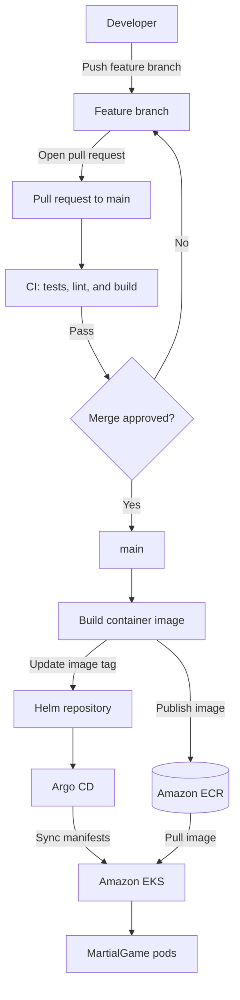

# MartialGame

MartialGame is a containerized web application delivered to Amazon EKS through a GitOps workflow. The project brings together the application, cloud infrastructure, and Kubernetes deployment configuration across three repositories.

**Live demo:** [martialgame.voidcode-beni.xyz](https://martialgame.voidcode-beni.xyz)

## Project repositories

- **Application:** [martialgame](https://github.com/B-Jayree/martialgame) — application source, container image, and CI/CD workflow.
- **Deployment configuration:** [martialgame-helm](https://github.com/B-Jayree/martialgame-helm) — Helm charts and environment values monitored by Argo CD.
- **Cloud infrastructure:** [martialgame-infra](https://github.com/B-Jayree/martialgame-infra) — Terraform configuration for AWS networking, EKS, IAM, and ECR.

## Architecture



## Delivery workflow

Pull requests to `main` run the project's validation checks. After a change is merged:

1. GitHub Actions assumes an AWS IAM role using OIDC.
2. The workflow builds the Docker image and publishes it to Amazon ECR.
3. The image is tagged with the short Git commit SHA. The workflow also publishes a `latest` tag.
4. The workflow updates the image tag in `martialgame-helm`.
5. Argo CD detects the Git change and synchronizes the deployment to EKS.
6. EKS pulls the new image from ECR and rolls out the updated pods.

The deployment uses the commit-specific image tag so that each GitOps change identifies a specific build.

### GitHub configuration

The application workflow requires the following secret:

| Secret | Purpose |
| --- | --- |
| `HELM_REPO_PAT` | Allows the workflow to update `martialgame-helm`. |

AWS access is provided through GitHub Actions OIDC rather than long-lived AWS credentials.

## Run locally

### Development server

From the application directory, install dependencies and start the development server:

```bash
npm install
npm run dev
```

Open [http://localhost:3000](http://localhost:3000).

### Docker

To use the Docker image, start the Docker-enabled Vagrant environment from the `vagrant` directory:

```bash
vagrant up
vagrant ssh
```

Then run the application container in the environment:

```bash
docker run -p 3000:3000 bjayree/martialgame
```

Open [http://localhost:3000](http://localhost:3000).

## Deployment and rollback

Deployments are driven by changes in Git. Merging to `main` publishes an image and updates its tag in `martialgame-helm`; Argo CD then reconciles the cluster with the repository configuration.

To roll back, revert the image-tag change in `martialgame-helm`. Argo CD will apply the reverted configuration.

## Troubleshooting

| Symptom | Possible cause | Suggested action |
| --- | --- | --- |
| `ImagePullBackOff` | The EKS nodes cannot pull from ECR. | Check the node IAM permissions and ECR access configuration. |
| The workflow cannot check out `martialgame-helm`. | `HELM_REPO_PAT` is missing, expired, or lacks repository access. | Create or update the token with the required access, then update the repository secret. |
| ECR login fails in GitHub Actions. | The OIDC provider or IAM role trust policy is misconfigured. | Verify the AWS identity provider and the role's GitHub trust conditions. |
| The Docker build fails. | A dependency, lockfile, or base image issue. | Review the build logs and verify dependencies and base image availability. |

## Game features

The game combines cultivation progression, character creation, story content, and a window-based feature workspace.

### Modes and character creation

- **Free Mode** provides sandbox character creation without attribute ceilings.
- **Normal Mode** uses a 20-point character budget.
- **Story Mode** uses a story template and a difficulty-specific point budget.
- Character creation is available at `/journey`; the classic interface is available at `/game-v1`.
- The unified version 2 interface is available at `/game-v2`; `/game` redirects to it.
- A dismissible roadmap and optional interactive guide introduce the game.

### Game workspace and saves

- Open multiple feature windows in the workspace, then drag, resize, expand, or restore them.
- Window content scales proportionally when resized.
- The character record is available at `/game-v2/character`.
- Save Slots supports multiple browser-local snapshots and JSON import/export.
- Gameplay state is persisted in browser storage and a rolling autosave.
- Story Mode selects one story path per save; create another save to explore a different path.

### Cultivation and progression

- The in-game calendar uses 365 days per year. Actions such as conversations, gifts, purchases, favors, and breakthroughs advance time.
- Training can run for a selected number of whole days (up to 3,650) or stop at the next minor achievement.
- Travel time is estimated from map distance. Cultivation grounds are available at each location, with location bonuses and graded chambers affecting absorption and comprehension.
- Attribute ceilings increase by realm. Physical attributes use the Core ceiling; aptitude, comprehension, looks, and luck use the Insight ceiling. Free Mode bypasses these caps.
- Body Tempering is the first cultivation realm and uses body progress rather than Qi. Body Dao offers a parallel path at the Body Tempering peak.
- Qi Condensation forms the dantian and progresses through nine stages. Foundation progression includes standard and Heavenly Dao paths, with Qi quality and capacity affected by cultivation.
- Realm barriers use soul-art deduction and barrier power. Legacy saves that used `Mortal` as a realm are migrated to Body Tempering.

### Story, relationships, and combat

- Story chapters appear in Quests, progress through realm requirements, and reward gold and experience when claimed.
- Story Mode begins with a generated prologue based on the character's name, background, family, spirit root, attributes, difficulty, dynasty, and sect.
- Relationships use affinity tiers and can develop through conversations, gifts, and personal favors.
- Sect activities include shops, disciple hierarchy, commissions, secret arts, sparring, and admission.
- Location-based monster encounters use enemy profiles with realm, stats, rewards, and drops.
- Combat arts require comprehension to Minor Accomplishment and consume a separate combat-Qi pool. Combat previews estimated damage and Qi cost; each combat action advances the calendar by one day.
- Cultivation restores combat Qi. Defeat is lethal in hard Story Mode.

## Extending the game

- Add a feature screen under `components/game/features/`, create its descriptor under `lib/features/`, and register it in `lib/features/gameFeatures.js`. Set `enabled` to `false` to hide it from version 2 navigation without removing its implementation.
- Organize content by domain under `lib/data/`. Domain index files gather content for the game; keep large, independently maintained entries in separate files and related collections together.
- Add techniques to the appropriate category under `lib/data/techniques/` and register new categories in `lib/data/techniques/index.js`. Cultivation modifiers are handled in `lib/gameEngine/cultivationModifiers.js`.
- Story templates, world locations, people, sect rosters, and enemy profiles are organized under their respective data directories.

## Versioning

The documented game version is **v1.1.0**. Bug fixes use patch versions (for example, `v1.1.1`); substantial feature releases use the next minor version (planned as `v1.2.0`).
